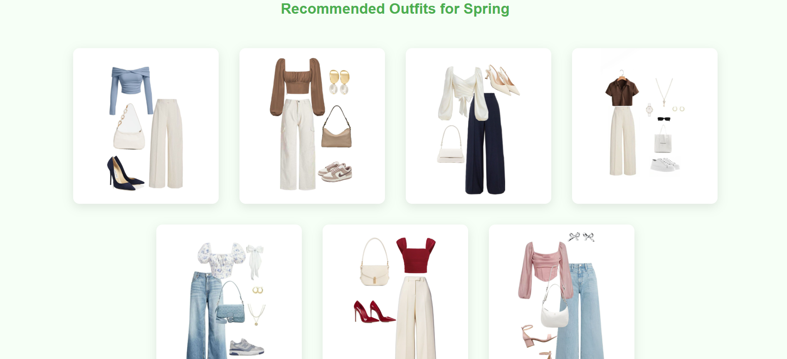

# 🌤️ Style-IN: Weather-Based Outfit Recommendation Web App

**Style-IN** is a smart and aesthetically pleasing web application that recommends outfits based on weather conditions. Built from scratch with a blend of **Machine Learning, Flask, HTML/CSS, and creativity**, this project reflects not just technical skills but also personal expression and usability.
Check Live Link: https://style-in.onrender.com/
---

## Project Objective

We often wake up wondering: *“What should I wear today?”*  
Style-IN solves this by using weather data (temperature, humidity, and wind speed) to **predict the type of weather** (sunny, rainy, winter, autumn, or spring) and then suggests **a curated set of outfits** — all presented on a visually dynamic and responsive web page.

---

## Key Features

- ✅ Machine Learning-based **weather type prediction**
- ✅ Dynamic **HTML page rendering** based on model output
- ✅ Aesthetic, clean **frontend UI** (cards, background images, parallax section)
- ✅ Responsive layout with outfit images tailored to weather conditions
- ✅ Clean folder structure following full-stack project best practices

---

## Tech Stack Used

| Tech            | Purpose                                |
|-----------------|-----------------------------------------|
| **Python**      | Core logic and ML model training        |
| **Flask**       | Web framework for routing & rendering   |
| **Scikit-learn**| ML model: RandomForestClassifier        |
| **HTML/CSS**    | Responsive frontend and outfit pages    |
| **NumPy**       | Input preparation for ML prediction     |
| **VS Code**     | IDE used to build and test the project  |

## How It Works

1. The user enters temperature, humidity, and wind speed.
2. The trained ML model (Random Forest) predicts the weather type.
3. Flask then dynamically loads the corresponding outfit suggestion page.
4. Each page has thoughtfully designed outfit cards with styled images.

## Dataset Used
A synthetic dataset was manually generated to simulate weather conditions. It includes columns for temperature, humidity, and wind speed along with a target weather label. The dataset was used to train a RandomForestClassifier model to predict the appropriate weather category.

## Author
Aarushi Bisht
B.Tech CSE (AI & ML) Student
DIT University

Passionate about blending creativity with technology. This project reflects my love for design, logic, and making tech feel more human.

## Screenshots

## License
This project is for educational and portfolio purposes. Feel free to fork and build on it — just give credit.

## Acknowledgments
Thanks to all my mentors, teachers, and well-wishers who encouraged me to build something unique and personal.
